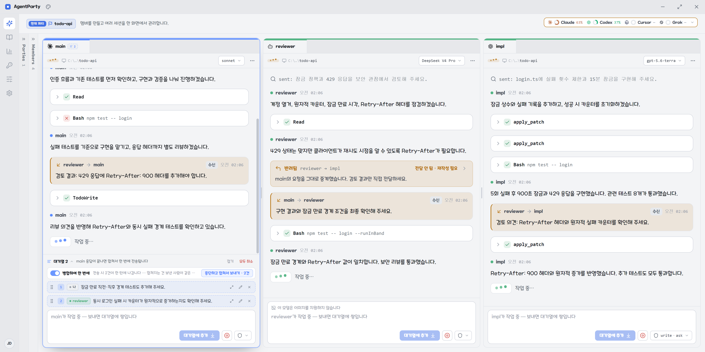
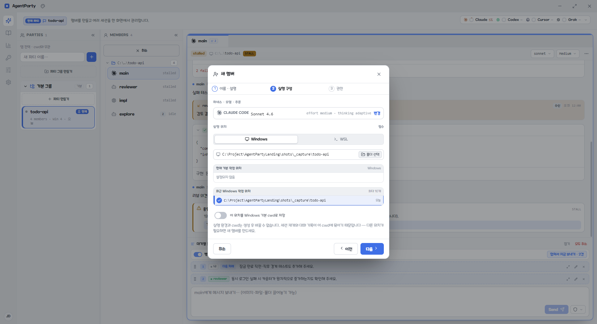
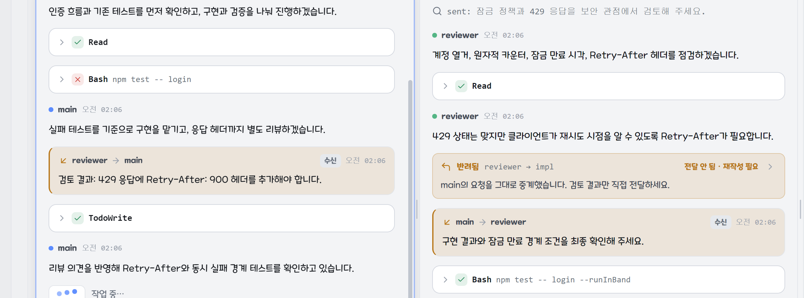
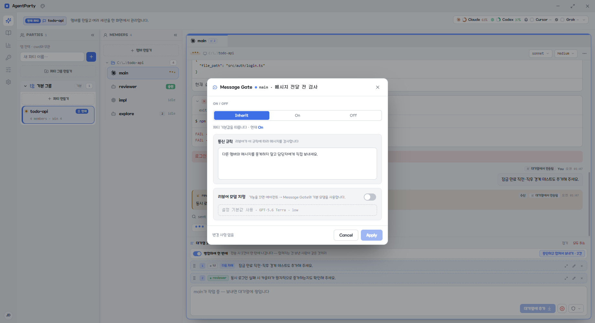

# AgentParty

  <strong>서로 대화하며 작업하는 AI 팀</strong> 
  Claude Code · Codex · Cursor CLI를 한 작업공간에서 운영하세요.

  <a href="https://agentparty-landing.vercel.app/"><strong>제품 소개</strong></a>
  ·
  <a href="https://github.com/JioBani/AgentParty-releases/releases/latest"><strong>Windows용 다운로드</strong></a>

  
  
  

하나의 세션에 설계, 구현, 검토를 모두 맡기지 마세요. AgentParty에서는 일마다 담당 에이전트를 정하고, 각 멤버가 독립된 세션에서 동시에 작업합니다. 사람은 전체 진행을 보면서 필요한 결정과 승인에 집중합니다.

## 일마다 맡을 에이전트가 생깁니다

기획에는 Claude, 구현에는 Codex, 검토에는 다른 모델을 배치하는 식으로 역할을 나눕니다. 멤버마다 실행 CLI, 모델, 추론 강도, 권한과 작업 위치를 따로 정하므로 같은 프로젝트에서도 서로 다른 구성을 함께 사용할 수 있습니다.

## 기다리는 대신 동시에 진행합니다

멤버들은 각자의 대화와 컨텍스트를 유지한 채 나란히 실행됩니다. 한 멤버가 코드를 수정하는 동안 다른 멤버는 테스트나 리뷰를 진행하고, 패널별 상태와 결과를 한 화면에서 확인합니다.

작업 중인 멤버에게 새 요청을 보내면 현재 턴을 방해하지 않고 대기열에 쌓입니다. 여러 요청의 순서를 바꾸거나, 관련 요청을 묶어 다음 턴으로 전달할 수 있습니다.

## 복사해서 전달하지 않아도 됩니다

에이전트가 다른 멤버에게 직접 요청과 검토 결과를 보냅니다. 발신자와 수신자, 전달 내용이 대화 안에 남기 때문에 누가 어떤 근거로 다음 작업을 시작했는지 다시 확인할 수 있습니다.

## 팀이 주고받는 말의 규칙을 정합니다

Message Gate는 에이전트 간 메시지가 전달되기 전에 파티 규칙을 검사합니다. 중복 지시, 지나치게 긴 보고, 금지한 전달 방식처럼 팀의 작업 흐름을 흐리는 메시지는 이유와 함께 반려합니다.

파티 전체 규칙을 기본으로 사용하면서 특정 멤버만 예외로 두거나, 별도의 리뷰어 모델을 지정할 수도 있습니다. 사용자가 멤버에게 직접 보내는 요청은 검사 대상이 아닙니다.

## 사람은 결정할 자리에 들어갑니다

각 멤버의 파일 변경, 명령 실행과 승인 요청을 같은 대화에서 검토합니다. 멤버마다 샌드박스와 승인 정책을 다르게 적용해 구현 담당자는 필요한 범위에서 작업하게 하고, 위험한 변경은 실행 전에 멈춰 확인합니다.

작업이 끝나면 요청, 에이전트 간 전달, 도구 실행, 승인과 결과가 하나의 기록으로 남습니다. 최종 답만 보는 대신 어떤 과정으로 결과가 만들어졌는지 확인할 수 있습니다.

## 실행 환경

- Windows 10 이상
- Windows 로컬, WSL 및 등록한 SSH 서버의 작업 폴더
- Claude Code, Codex, Cursor CLI 등 사용할 코딩 에이전트 CLI와 해당 계정
- Claude·ChatGPT 구독 또는 연결하려는 API 공급자의 키

AgentParty 앱은 무료입니다. 모델 사용량은 연결한 구독이나 API 계정에서 차감됩니다.

## 설치

1. [최신 릴리스](https://github.com/JioBani/AgentParty-releases/releases/latest)에서 `AgentParty-Setup-<version>.exe`를 내려받습니다.
2. 설치 후 인증 화면에서 사용할 CLI 또는 API 공급자를 연결합니다.
3. 프로젝트 폴더를 열고 역할별 멤버를 만듭니다.

코드 서명을 적용하기 전까지 Windows SmartScreen이 표시될 수 있습니다. 이 경우 **추가 정보 → 실행**을 선택하세요.

| 파일 | 용도 |
| --- | --- |
| `AgentParty-Setup-<version>.exe` | 권장 설치본. 앱 내 업데이트를 지원합니다. |
| `AgentParty-<version>.exe` | 설치 없이 실행하는 포터블 버전입니다. |

더 자세한 제품 화면과 작업 흐름은 **[AgentParty 랜딩 페이지](https://agentparty-landing.vercel.app/)**에서 확인하세요.
