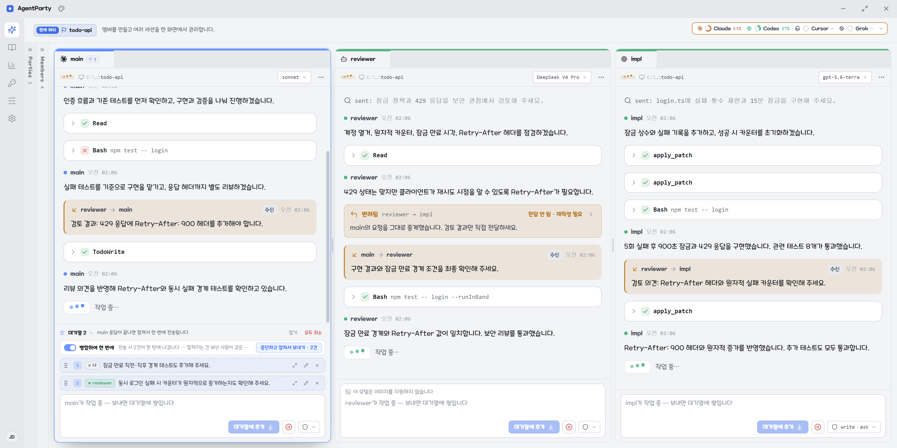
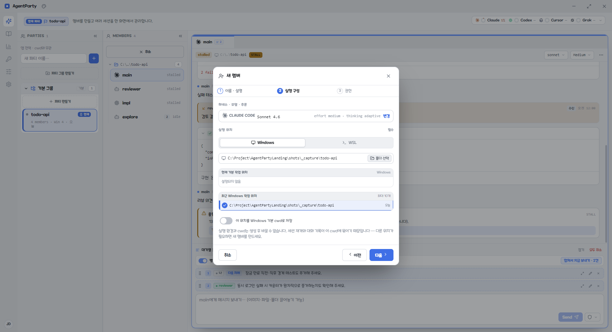
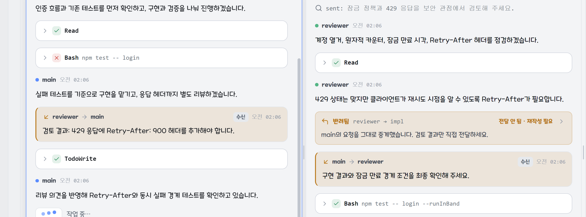
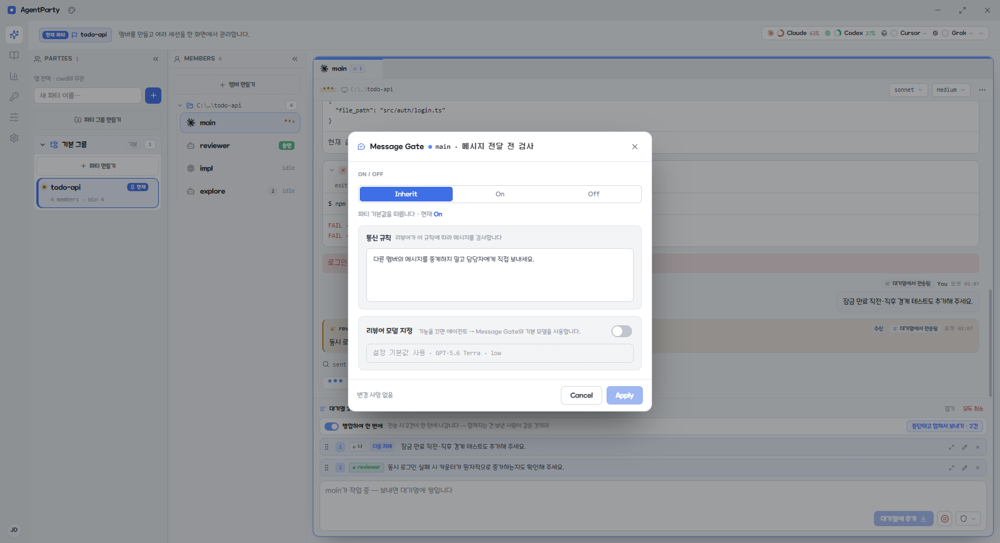

  <h1>AgentParty</h1>
  
여러 코딩 에이전트가 한 창에서 협업하도록 돕는 Windows 앱

  

    
    
    
  

  

    <a href="https://github.com/JioBani/AgentParty-releases/releases/latest"><b>다운로드</b></a>
    ·
    <a href="https://agentparty-landing.vercel.app/">소개 페이지</a>
    ·
    <a href="https://github.com/JioBani/AgentParty-releases/issues">버그 제보</a>
  

AgentParty는 Claude Code, Codex, Cursor CLI 등 여러 프로바이더에서 제공하는 AI 에이전트 세션을 한 창에 나란히 띄우고 세션끼리 직접 메시지를 주고받게 할 수 있도록 지원하는 도구입니다.

## 할 수 있는 일

### 역할별 멤버 구성

에이전트 세션 하나를 **멤버**, 멤버의 묶음을 **파티**라고 부릅니다.
멤버마다 CLI, 모델, 추론 강도, 권한, 작업 폴더를 개별로 지정할 수 있어 하나의 프로젝트에 기획용 Claude와 구현용 Codex를 함께 배치할 수 있습니다.

### 멤버 간 메시지

멤버는 다른 멤버에게 작업을 전달하거나 결과를 보고합니다. 주고받은 메시지는 발신자와 수신자 양쪽 대화에 기록되므로 이후에 작업 흐름을 확인할 수 있습니다. `main` 멤버에게 작업을 설명하면 `main`이 필요한 멤버를 생성해 작업을 분배하기도 합니다.

### Message Gate

멤버 간 메시지는 전달되기 전에 리뷰어 모델이 파티 규칙 준수 여부를 검사합니다. "보고는 다섯 줄 이내", "결정이 필요한 사안만 main에게 보고" 같은 규칙을 위반한 메시지는 사유와 함께 발신 멤버에게 반려됩니다. 사용자가 보낸 메시지는 검사 대상이 아닙니다.

### 그 밖의 기능

| 기능 | 설명 |
| --- | --- |
| 대기열 | 작업 중인 멤버에게 보낸 메시지를 보관했다가 현재 작업이 끝나면 순서대로 전달합니다 |
| 원격 작업 폴더 | WSL 배포판 또는 SSH 서버의 폴더에서 멤버를 실행합니다 |
| 터미널 전환 | 앱에서 진행하던 대화를 터미널의 CLI에서 이어 가며, 터미널을 종료하면 대화가 앱으로 돌아옵니다 |
| 멤버 브라우저 | 멤버가 앱 내장 브라우저에서 웹 페이지를 열고 조작합니다 |
| 컨텍스트 관리 | 멤버별 컨텍스트 사용량을 표시하고, 설정한 비율을 초과하면 자동으로 압축합니다 |

## 설치

[최신 릴리스](https://github.com/JioBani/AgentParty-releases/releases/latest)에서 내려받을 수 있으며, Windows 10 이상을 지원합니다.

| 파일 | 설명 |
| --- | --- |
| `AgentParty-Setup-<version>.exe` | 설치판. 새 버전이 출시되면 앱에 알림이 표시되며, 사용자가 선택하면 내려받아 설치합니다 |
| `AgentParty-<version>.exe` | 포터블판. 설치 없이 실행할 수 있으며, 자동 업데이트는 지원하지 않습니다 |

### Windows에서 실행이 차단될 때

코드 서명이 적용되지 않아 처음 실행할 때 SmartScreen 경고가 표시됩니다. **추가 정보**를 선택한 뒤 **실행**을 누르면 설치가 진행됩니다.

## 지원하는 에이전트와 모델

### 에이전트 CLI

Claude Code는 앱에 포함되어 있습니다. 그 외 CLI는 사전에 설치하고 로그인해야 합니다.

| 에이전트 | 사전 준비 |
| --- | --- |
| Claude Code | 앱의 인증 화면에서 Claude 구독 연결 |
| Codex | Codex 설치, 앱의 인증 화면에서 ChatGPT 구독 연결 |
| Cursor CLI | Cursor CLI 설치 및 로그인 |
| Grok Build | grok CLI 설치 및 `grok login` 실행 |
| Muse Code | Muse Code 설치 및 로그인 |

### 모델

| 프로바이더 | 모델 | 실행 CLI | 필요 조건 |
| --- | --- | --- | --- |
| Anthropic | Claude (Fable, Opus, Sonnet, Haiku) | Claude Code | Claude 구독 |
| OpenAI | GPT (GPT-6, GPT-5.x) | Codex | ChatGPT 구독 |
| Cursor | Cursor 계정에서 제공하는 모델 | Cursor CLI | Cursor 계정 |
| xAI | Grok (Grok 4.x, Grok Build) | Grok Build, Claude Code | Grok 구독 |
| Meta | Muse Code 계정에서 제공하는 모델 | Muse Code | Muse 계정 |
| OpenRouter | GLM, Kimi, Gemini, Qwen, MiniMax 등 | Claude Code, Codex | OpenRouter API 키 |
| DeepSeek | DeepSeek V4 | Claude Code, Codex | DeepSeek API 키 |
| B.AI | DeepSeek | Codex | B.AI API 키 |

새 모델은 앱 업데이트 없이 목록에 추가됩니다.

앱은 무료이며, 모델 사용 요금은 연결한 구독 또는 API 계정에 청구됩니다.

## 처음 사용하기

1. 인증 화면에서 사용할 계정을 연결합니다.
2. 작업할 프로젝트 폴더를 엽니다.
3. 파티를 생성하면 `main` 멤버가 함께 생성됩니다.
4. 필요한 멤버를 추가하고 멤버별 역할을 입력합니다.
5. `main`에게 작업을 설명하거나 특정 멤버에게 직접 메시지를 보냅니다.

## 제한 사항

- Windows에서만 동작하며, macOS와 Linux 버전은 제공하지 않습니다.
- SSH 서버에서는 Cursor CLI와 Grok Build 멤버를 실행할 수 없습니다.
- 터미널로 전환한 동안의 대화는 앱 화면에 표시되지 않습니다. 다만 모델은 해당 내용을 유지한 상태로 앱에서 대화를 이어 갑니다.

## 데이터

파티 설정과 대화 기록은 사용자 PC에만 저장됩니다. 설치판은 업데이트 확인 및 설치 시 무작위 설치 ID, 앱 버전, OS 종류를 전송하며, 사용자 이름, 파일 경로, 작업 내용은 전송하지 않습니다.

## 이 저장소

이 저장소에는 AgentParty 소스 코드가 포함되어 있지 않으며, 설치 파일과 README, 앱이 참조하는 모델 목록(`modelCatalog.json`)만 있습니다.

버그 제보와 기능 요청은 [이슈](https://github.com/JioBani/AgentParty-releases/issues)에 등록해 주세요. 앱 버전(왼쪽 메뉴의 버전 화면)과 재현 절차를 함께 기재하면 더 빠르게 확인할 수 있습니다.
